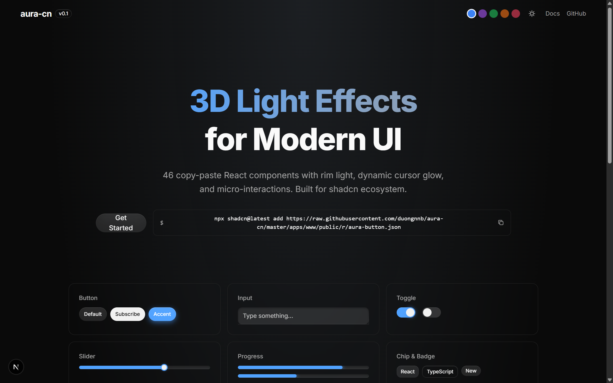
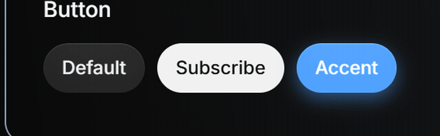
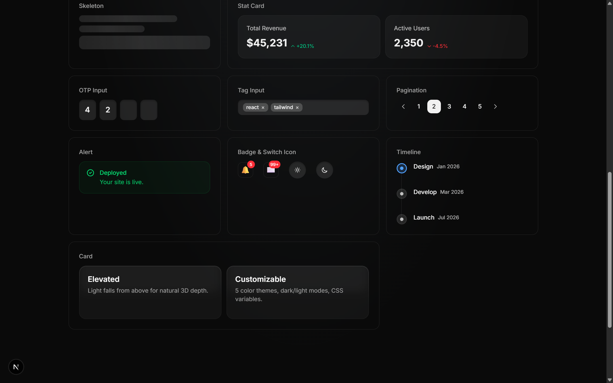
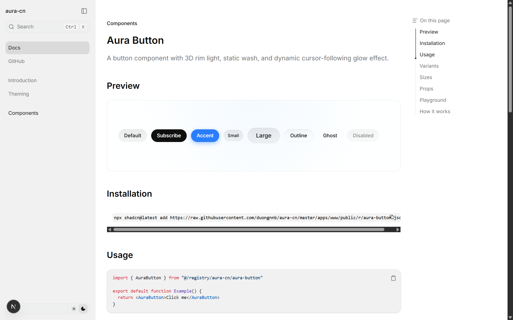

# aura-cn

[](https://opensource.org/licenses/MIT)
[](https://react.dev)
[](https://nextjs.org)
[](https://tailwindcss.com)
[](https://github.com/duongnnb/aura-cn#components-46)

A visual-effects focused UI component library with **3D rim light**, **dynamic cursor glow**, and **micro-interactions**. Built for React, inspired by [shadcn/ui](https://ui.shadcn.com).



## Features

- **Rim Light** — Gradient border via `mask-composite: exclude`
- **Wash Light** — Static radial glow from top center
- **Dynamic Glow** — Cursor-following light effect via CSS variables
- **Light/Dark Mode** — Automatic via CSS variables with `prefers-color-scheme`
- **Framer Motion** — Built-in entrance animation presets (`fade-up`, `scale`, `blur`, etc.)
- **Interactive Playground** — Props editor in documentation
- **Zero Runtime** — Pure CSS + Tailwind, no JS overhead for styling
- **shadcn-compatible** — Install via `npx shadcn@latest add` from registry



## Installation

```bash
npx shadcn@latest add https://raw.githubusercontent.com/duongnnb/aura-cn/master/apps/www/public/r/aura-button.json
```

## Components (46)

| Category | Components |
|----------|-----------|
| **Actions** | Button, FAB, Chip, Badge |
| **Inputs** | Input, Textarea, Select, Toggle, Switch Icon, Checkbox, Radio, Slider, DatePicker, OTP Input, Tag Input, Autocomplete, File Upload, Color Picker |
| **Navigation** | Navbar, Sidebar, Breadcrumb, Pagination, Tabs, Command Palette, Dropdown |
| **Feedback** | Alert, Toast, Progress, Skeleton, Tooltip, Notification Badge |
| **Overlays** | Modal, Drawer, Popover, Confirm Dialog |
| **Layout** | Card, Accordion, Divider, Timeline, Carousel |
| **Data Display** | Table, Avatar, Stat Card, Tree View, Data List |
| **Animation** | Motion (entrance presets), Stagger |
| **Theming** | Theme provider with color presets |



## Quick Start

```tsx
import { AuraButton } from "@/registry/aura-cn/aura-button"
import { AuraMotion } from "@/registry/aura-cn/aura-motion"

export default function App() {
  return (
    <AuraMotion preset="fade-up">
      <AuraButton variant="accent" enableGlow>
        ✨ Glow Button
      </AuraButton>
    </AuraMotion>
  )
}
```

## Tech Stack

- **Framework**: React 19 + Next.js 16
- **Styling**: Tailwind CSS 4 + CSS Variables
- **Variants**: class-variance-authority (cva)
- **Animations**: Framer Motion 12
- **Docs**: Fumadocs + MDX
- **Monorepo**: Turborepo + pnpm workspaces

## Development

```bash
# Install dependencies
pnpm install

# Start dev server (http://localhost:3000)
pnpm --filter @aura-cn/www dev

# Build
pnpm --filter @aura-cn/www build

# Build registry JSON files
node apps/www/scripts/build-registry.mjs
```

## Project Structure

```
apps/
  www/                    # Documentation site
    content/docs/         # MDX documentation pages
    src/
      registry/aura-cn/   # Component source files
      components/         # Site components (demos, playground)
      lib/site-config.ts  # Centralized config (registry URL)
    public/r/             # Built registry JSON files
    scripts/              # Build scripts
```

## Design System

Every component adapts to light and dark mode automatically:



All components use CSS variables that adapt to light/dark mode:

| Variable | Light | Dark |
|----------|-------|------|
| `--bg-surface` | `rgba(0,0,0,0.05)` | `rgba(255,255,255,0.1)` |
| `--rim-light` | `rgba(0,0,0,0.08)` | `rgba(255,255,255,0.15)` |
| `--text-primary` | `#0f0f0f` | `#f1f1f1` |
| `--text-secondary` | `rgba(0,0,0,0.6)` | `rgba(255,255,255,0.7)` |
| `--dynamic-light-color` | `rgba(0,0,0,0.1)` | `rgba(255,255,255,0.22)` |

## License

MIT
